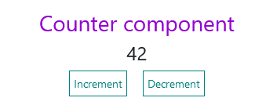

[CV on Github](https://github.com/VictorKachin/rsschool-cv)
# Victor Kachin

## Contacts:
* ___Location:___ Novopolotsk, Vitebsk reg., Belarus
* ___Phone:___ +375 29 883-53-53
* ___Email:___ victor.kachin@gmail.com 
* Telegram: @VictorKachin
* [LinkedIn](https://www.linkedin.com/in/victor-kachin/)
* [GitHub](https://github.com/VictorKachin)

## About Me: 

I'm 47 years old. Exactly a year ago, I decided to radically change my life - to devote myself to mastering a new profession - to become a programmer.

Before I started studying at RS School, I studied web development, frontend on my own.

My main goal is to gain steady knowledge in web development and constantly develop my skills.

I am always open to new knowledge, training and professional contacts.

## My Skills:

* HTML and CSS (SASS/SCSS, BEM)
* SASS
* JavaScript (basic)
* React.js (basic)
* VS Code, WebStorm
* Git, GitHub
* Figma

## Code example:
```jsx
import React, {useState} from 'react';
import MyButton from "./UI/buttons/MyButton";

const Counter = () => {
  const [count, setCount] = useState(0);
  const increment = () => {
    setCount(count + 1)
  };
  const decrement = () => {
    setCount(count - 1)
  };

  return (
      <div style={{textAlign: 'center'}}>
        <h3 style={{color: 'darkviolet'}}>Counter component</h3>
        <h4>{count}</h4>
        <MyButton
            style={{marginRight: 20, padding: 5}}
            onClick={increment}
        >
          Increment
        </MyButton>
        <MyButton
            style={{padding: 5}}
            onClick={decrement}
        >
          Decrement
        </MyButton>
      </div>
  );
};

export default Counter;
```


## Education:
Polotsk State University, Economics and Finance - Sep 1992 - Aug 1996

## Experience:

For a long time, from 1996 to 2017, I worked as an:
* accountant, 
* economist, 
* manager, 
* head of a home appliance store,
* and small business owner (a trading company);

And from 2017 to 2020 - I worked as a taxi driver.

In 2020, I started learning frontend web development on my own.

From March 2021 have experience in the small team on several projects in commercial Frontend development (HTML/CSS, JavaScript, React.js).

## Language:
* Russian (native language); 
* Belarusian (fluent);
* English (A2);

***

> #### Live and learn
> _"Live as if you were to die tomorrow. Learn as if you were to live forever"_ (Mahatma Gandhi)